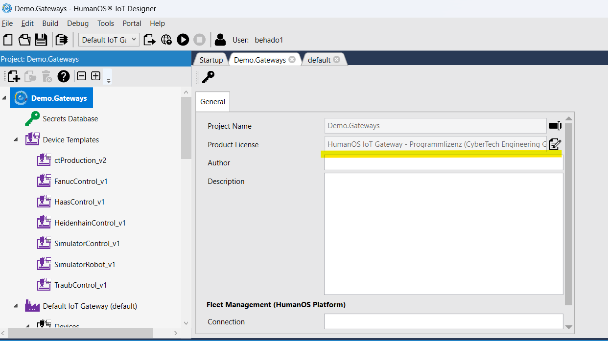
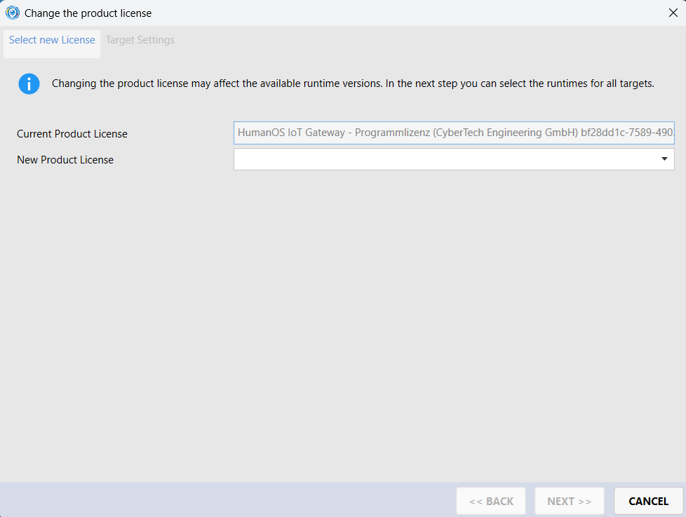

# ctProduction Agents

Collection of HumanOS Agents used to extend ctProduction Platform.

The agent require a valid HumanOS License. Get the license directly from [CyberTech Engineering Sales](mailto:info@cybertech.swiss).

## Workplace and Machine Configurations

- ctProduction Container encompassing sub devices (facility components)
- [FANUC CNC](https://doc.cybertech.swiss/runtime/Manuals/HumanOS.UHAL.FanucControl/) Template
- HAAS CNC Template
- Traub OPC-UA Template
- [Heidenhain](https://doc.cybertech.swiss/runtime/Manuals/HumanOS.UHAL.HeidenhainControl/) (iTNC530, TNC64x, TNC7 native)
- [Simulators](https://doc.cybertech.swiss/runtime/Manuals/HumanOS.UHAL.FileReader/) for Machine Controls and Robots

## How to Switch the License

After cloning the repository, you have to switch the license in the HumanOS IoT projects.

1. Open the project in HumanOS IoT Designer
2. Double click on the root entry of the project
3. Click on the "edit" button next to the "Project License"

   

4. Select your license

   
